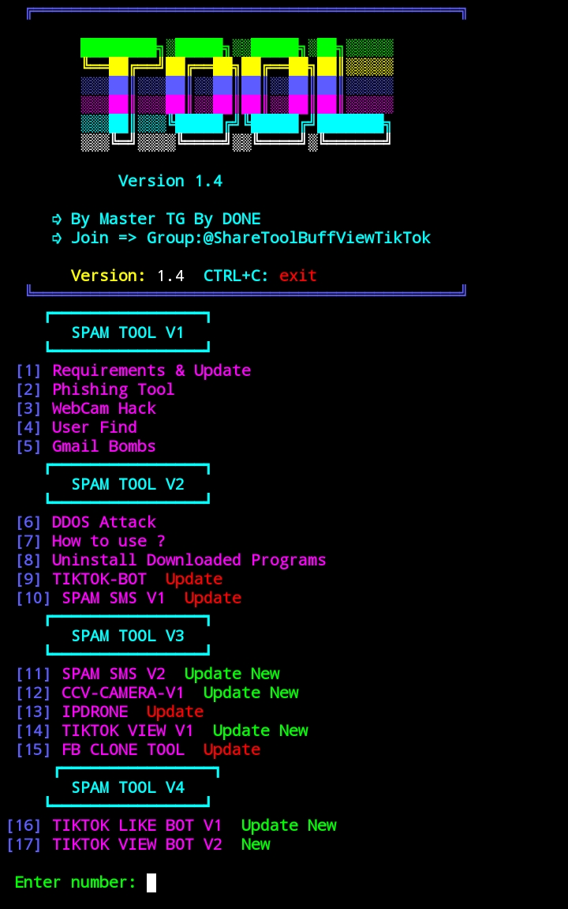

## HACKING_Version2
https://github.com/mastertgtool/HACKING_Version2.git
    
  </a>

# How to Install
```sh
pkg install git
```
```sh
git clone https://github.com/mastertgtool/HACKING_Version2.git
```
```sh
cd HACKING_Version2
```
```sh
bash ALL.sh
```
 
# Tools I Use

